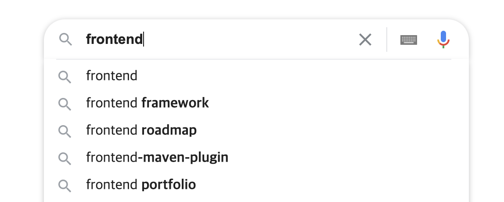
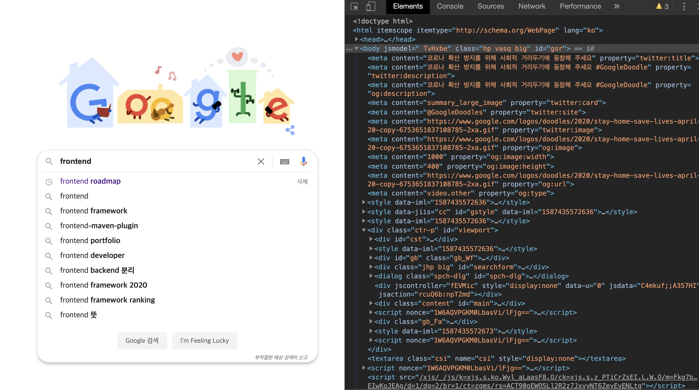

# 📝 DOM

## 🧑🏼‍🚀 DOM을 알아야 하는 이유

❗자바스크립트를 이용해 html에서 데이터를 가져오고 싶다면?  
❗웹페이지에 보여지는 데이터를 변경하고 싶다면?  
❗인터렉티브한 웹어플리케이션을 만들고 싶다면?

단순히 정보를 보여주는 웹페이지가 아니라, 동적인 기능이 있는 웹어플리케이션을 만들고 싶다면, 문서를 조작할 수 있게 해주는 DOM을 알아야 합니다.

<br>
<br>

## 🙋🏻‍♂️ 이 문서를 보고 나면

- [ ] DOM이 왜 필요한지 말할 수 있다.
- [ ] DOM을 찾는 방법을 메서드를 4가지 이상 알 수 있다.
- [ ] DOM을 변경, 조작하는 메서드를 최소 2가지 찾고, 사용해 볼 수 있다.

<br>
<br>

## 📝 DOM : Document Object Model

지하철역을 동적으로 추가하는 것과 같이 웹페이지 문서를 조작하기 위해서 필수적으로 알아야 하는 것이 DOM입니다.
DOM은 Document Object Model의 약자인데요. 구글에서 DOM에 대해서 검색해보면 아래와 같이 나옵니다.

> 문서 객체 모델(Document Object Model)은 HTML, XML 문서의 프로그래밍 interface입니다. DOM은 문서의 구조화된 표현(structured representation)을 제공하며 프로그래밍 언어가 DOM 구조에 접근 할 수 있는 방법을 제공하여 문서 구조 및 스타일, 내용 등을 변경할 수 있게 도와줍니다.

위와같은 정의가 처음에는 잘 와닿지 않을 수 있습니다.
하지만 낯선 지식도 포인트를 잡고 보면 훨씬 이해하기 쉬워지는데요. 이 정의에서 우리가 우선적으로 주목할 포인트가 있습니다.

> DOM은 프로그래밍 언어가 DOM 구조에 접근할 수 있는 방법을 제공하여
> 문서 구조, 스타일, 내용 등을 변경할 수 있게 돕는다.

즉 DOM은 자바스크립트와 같은 프로그래밍 언어가 문서의 구조에 접근할 수 있는 방법을 제공하고, 변경할 수 있게 해준다는 것입니다.
예를 들어 우리가 frontend에 대해 검색을 한다고 해봅시다.



검색하고 싶은 키워드를 처리해서 서버에 전송을 해야할텐데요. html 문서에 있는 모든 문자열에서 저 키워드를 검색해서 가져오려면 불필요한 작업들이 너무 많아질 것입니다. 한 단어를 가져오기 위해 문서 전체를 스캔해야 하니깐요. 실제로 검색창만으로 간단한 ui를 가진 구글 검색화면은 아래처럼 수많은 html 태그들로 이루어져 있습니다.



하지만 DOM이 있기 때문에 우리는 DOM이 제공하는 API를 이용해서 검색어에 해당하는 문자열을 보다 쉽게 가져올 수 있습니다.

<br>
<br>

## 🖥️ DOM API 사용하기

검색어를 입력받는 DOM에 접근하기 위해 아래 검색 input의 태그 예시를 살펴봅시다.

```js
<input id="search" class="search-input-style">
```

DOM API에는 getElement 혹은 getElements로 객체를 가져오는 메서드들이 있습니다.
이런 메서드를 이용해 인자로 엘리먼트에 대한 조건을 전달하면 조건에 부합하는 특정 엘리먼트를 반환합니다.
`getElement`, `querySelector는` 엘리먼트를 한 개만 반환하고 `getElements`, `querySelectorAll는` 엘리먼트 여러 개를 반환합니다.

DOM 객체를 찾는 키워드는 크게 4가지 입니다.

### 1. tag로 찾기

```js
document.getElementsByTagName("input");
```

### 2. id로 찾기

속도가 가장 빠른 특징을 가짐

```js
document.getElementById("search");
```

### 3. className으로 찾기

```js
document.getElementsByClassName("search-input-style");
```

### 4. cssSelector로 찾기

일치하는 **_첫번째_** 엘리먼트

```js
document.querySelector(".search-input-style");
```

일치하는 모든 엘리먼트

```js
document.querySelectorAll(".search-input-style");
```

<br>
<br>

## 📘 정리

**_그래서 DOM은_**  
**_HTML을 위한 API이면서_**  
**_HTML을 탐색할 수 있고_**  
**_HTML의 구조를 바꿀 수도 있습니다._**

<br>
<br>

## 🔗 참고 링크

[MDN](https://developer.mozilla.org/ko/docs/Web/API/Document_Object_Model/Introduction)  
[DOM이란 무엇인가](https://velog.io/@godori/DOM이란-무엇인가)  
[DOM은 정확히 무엇일까?](https://wit.nts-corp.com/2019/02/14/5522)  
[Template literals](https://developer.mozilla.org/ko/docs/Web/JavaScript/Reference/Template_literals)

- ES6의 Template Literals 문법에 대한 글입니다. html template과 data를 결합해서 만들어 내는데 유용하니 꼭 참고해주세요.
