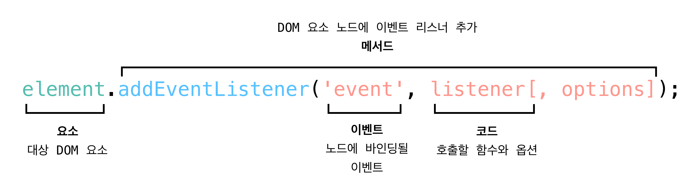

# 🎉 EVENT

## 🧑🏼‍🚀 Event를 알아야 하는 이유

❗input창에 값을 입력하고, 엔터를 쳤을 때 값을 리스트에 추가하고 싶다면?  
❗삭제 버튼을 눌렀을 때 값을 삭제하고 싶다면?  
❗인터렉티브한 사용자 경험을 만들고 싶다면?

위와 같은 이벤트를 유연하게 처리하기 위해서 우리는 반드시 이벤트를 알아야합니다.  
동적인 웹은 사용자와 상호작용이 잘 되야 합니다. 그리고 그 상호작용은 어떤 이벤트에 의해 발생합니다.  
그래서 프론트엔드에서 많은 인터렉션은 모두 **Event**를 처리하는 것과 깊은 관련이 있습니다.

<br>
<br>

## 🙋🏻‍♂️ 이 문서를 보고 나면

- [ ] 이벤트 종류를 최소 3가지 이상 말할 수 있다.
- [ ] DOM Element에 이벤트를 바인딩할 수 있다.
- [ ] 이벤트의 흐름을 제어할 수 있다.
- [ ] 이벤트 위임을 사용할 수 있다.

<br>
<br>

## 🎉 이벤트

웹을 탐색하는 동안 브라우저는 여러 종류의 이벤트를 등록합니다. 이벤트(event)는 어떤 사건을 의미하는데요.  
브라우저에서의 사건이란 사용자가 클릭 했을 '때', 스크롤을 했을 '때', 텍스트를 입력했을 '때'와 같은 것을 의미합니다.  
우리는 이제 사용자가 지하철 역 이름을 입력하고 엔터를 입력했을 '때', 삭제 버튼을 입력했을 '때'와 같은 이벤트들을 다룰 수 있어야합니다.

## 1. 이벤트의 종류

사용자의 이벤트를 다루기 위해서는 먼저, 이벤트의 종류에 대해 알아야합니다. 이 글에서는 기본적인 이벤트들을 다룹니다.

### 1) 👋사용자 인터페이스 이벤트

사용자 인터페이스(UI)이벤트는 브라우저가 로드한 HTML페이지가 아닌 브라우저 창을 사용할 때 발생하는 이벤트입니다.  
예를 들어, 페이지가 로드되었다거나 브라우저 창의 크기가 조정된 경우에 발생하는 이벤트들입니다.

| 이벤트 | 설명                                                                     |
| ------ | ------------------------------------------------------------------------ |
| load   | 웹 페이지의 로드가 완료되었을 때                                         |
| unload | 웹 페이지가 unload 될 때 (새로운 페이지를 요청한 경우)                   |
| error  | 브라우저가 자바스크립트 오류를 만났거나 요청한 자원이 존재하지 않는 경우 |
| resize | 브라우저 창의 크기를 조정했을 때                                         |
| scroll | 사용자가 페이지를 위아래로 스크롤 할 때                                  |

### 2) ⌨️키보드 이벤트

키보드 이벤트는 사용자가 키보드를 이용할 때 발생합니다.  
**keydown**이나 **keypress**이벤트에 대한 event 객체는 어떤 키가 눌렸는지를 알려주는 속성을 가지고 있습니다.

| 이벤트   | 설명                                                                                                                                                                                                            |
| -------- | --------------------------------------------------------------------------------------------------------------------------------------------------------------------------------------------------------------- |
| keydown  | 사용자가 키를 처음 눌렀을 때(키가 눌린 동안은 계속해서 발생)                                                                                                                                                    |
| keyup    | 사용자가 키를 뗄 때                                                                                                                                                                                             |
| keypress | 사용자가 키를 눌렀다가 떼어서 문자가 화면에 나타나게 되면 발생한다. 화살표 키를 누를 때 keydown 이벤트는 발생하지만 이 이벤트는 발생하지 않는다. 사용자가 키를 계속 누르고 있으면 이벤트가 반복적으로 발생한다. |

### 3) 🖱️마우스 이벤트

마우스 이벤트는 마우스를 움직이거나 버튼을 클릭했을 때 발생합니다.

| 이벤트    | 설명                                                               |
| --------- | ------------------------------------------------------------------ |
| click     | 마우스를 클릭했을 때                                               |
| dblclick  | 마우스를 더블 클릭했을 때                                          |
| mousedown | 마우스를 누르고 있을 때                                            |
| mouseup   | 요소 위에서 누르고 있던 마우스를 뗄 때                             |
| mousemove | 마우스를 움직일 때(터치스크린에서는 동작하지 않음)                 |
| mouseover | 요소 위로 마우스를 움직였을 때(터치스크린에서는 동작하지 않음)     |
| mouseout  | 요소 바깥으로 마우스를 움직였을 때(터치스크린에서는 동작하지 않음) |

### 4) 🔍focus와 blur 이벤트

사용자가 상호작용을 할 수 있는 링크나 폼 요소 같은 HTML 요소는 포커스를 받을 수 있습니다.  
이런 요소들은 자신이 포커스를 갖거나 잃을 때 이벤트를 발생시킵니다.
이 이벤트를 활용하는 경우는 다음과 같습니다.

- 사용자가 폼의 요소들과 상호직용을 할 때 도움말이나 피드백을 제공하고자 하는 경우(대부분 도움말은 실제 사용자가 상호직용을 하는 요소가 아닌 다른 요소를 통해 보여준다.)
- 사용자가 (폼을 제출할 때까지 기다리는 대신) 어느 한 요소에서 다른 요소로 이동했을 때 유효성검사를 수행할 필요가 있는 경우

| 이벤트        | 설명                      |
| ------------- | ------------------------- |
| focus/focusin | 요소가 포커스를 얻었을 때 |
| blur/focusout | 요소가 포커스를 잃었을 때 |

<br>
<br>

## 2. 이벤트 핸들러

사용자가 웹 페이지의 HTML과 상호작용할 때 이벤트를 핸들링하도록 프로그래밍할 수 있습니다.  
이벤트 핸들링 하는 방법에는 크게 3가지가 있습니다.

1. HTML 이벤트 핸들러.
2. 전통적인 DOM 이벤트 핸들러
3. 이벤트 리스너(Event Listener)  
   그러나 1,2번의 방법의 경우 잘 사용되지 않고, 3번의 방법으로 가장 많이 이벤트를 바인딩합니다. 따라서 이 글에서는 3번째 방법만 소개합니다.



<br>

### 이벤트 리스너(Event Listener) 활용

```js
function onDeleteTodoItemHandler() {
  // 이벤트 처리 로직을 구현한다.
}
// 아이템 삭제 버튼의 요소를 가져온다.
const $todoItemDeleteButton = document.querySelector("#todo-item-delete-btn");
// 클릭 이벤트가 발생했을 때 onDeleteTodoItemHandler함수가 실행되도록 바인딩 한다.
$todoItemDeleteButton.addEventListener("click", onDeleteTodoItemHandler);
```

1. `click` : 대기하고자 하는 이벤트. 위 예제에서는 클릭 이벤트를 기다립니다.
2. `onDeleteTodoItemHandler` : 이벤트가 발생했을 때 실행될 코드. 예제에서는 onDeleteTodoItemHandler() 함수를 사용합니다. 이 때 괄호를 생략하는 이유는 괄호를 사용하면 (이벤트가 발생할 때가 아니라) 이벤트가 바인딩 될 때 함수를 호출하라는 의미가 되기 때문입니다.

<br>

### 매개변수를 가진 이벤트 핸들러와 리스너

이벤트 핸들러에 지정된 함수에 괄호가 있는 경우 해당 함수는 바인딩 되는 순간 즉시 실행됩니다. 즉 함수가 이벤트를 기다리지 않고 바로 실행되어, 원치 않는 동작을 일으킵니다. 그래서 매개변수를 전달하고 싶다면 아래와 같은 형태의 익명 함수(anonymous function)를 이용해야 합니다.

```js
$todoItemDeleteButton.addEventListener("click", function () {
  // 익명함수는 두 번째 매개변수처럼 동작하며, 이름을 가진 함수를 둘러 싼다.
  onDeleteTodoItemHandler(name);
});

// 또는

$todoItemDeleteButton.addEventListener("click", () => {
  onDeleteTodoItemHandler(name);
});
```

익명 함수는 괄호를 가지고 있기는 하지만 이벤트가 발생했을 때만 실행됩니다. 이름을 가진 함수는 익명 함수가 호출될 때만 실행되며, 매개변수를 사용할 수 있게 됩니다.

<br>
<br>

## 3. 이벤트의 흐름과 제어

대부분의 HTML 요소는 다른 요소의 내부에 중첩됩니다. 그래서 버튼에 마우스를 가져가거나 클릭하면, 그 부모 요소 혹은 자식요소 또한 같이 클릭한 것과 같은 동작을 일으키는데요.  
링크를 가지고 있는 목록을 예로 들어보겠습니다. 이 링크를 클릭하면 자바스크립트는 `<a>` 요소에 이벤트를 발생시킴과 동시에 `<a>`를 포함하고 있는 다른 모든 요소들에도 동일한 이벤트를 발생시킵니다. 이벤트가 발생하는 순서를 이벤트 흐름(event flow)이라고 하며, 이벤트가 흐르는 방식은 다음의 두 가지가 있습니다.


**이벤트 버블링**: 이벤트가 사용자의 동작에 직접적으로 영향을 받은 노드로부터 바깥쪽으로 전파되어 나가는 방식.  
**이벤트 캡쳐링**: 이벤트가 가장 바깥쪽의 노드로부터 시작해서 안쪽으로 전파되어 들어오는 방식

위와 같은 이벤트의 흐름으로 인해 내가 원하는 동작이외에도 이벤트가 퍼져나가서 예상치 못한 오류가 발생하는 경우가 있습니다. 이 때 이벤트 객체가 제공해주는 메서드를 이용하면 문제를 미리 예방할 수 있습니다.

<br>

### Event 객체

Event 객체는 이벤트가 발생했을 때 **이벤트를 발생시킨 요소**와 **발생한 이벤트에 대한 정보**를 제공합니다. Event 객체가 제공하는 정보는 다음과 같습니다.

- 이벤트를 발생시킨 요소
- keypress 이벤트가 어떤 키에 의해 발생했는지에대한 정보
- 사용자가 어떤 요소를 클릭해서 click 이벤트가 발생했는지에 대한 정보

이벤트 객체는 이벤트 리스너로 지정된 함수에 자동으로 전달됩니다.

| 속성   | 목적                                                   |
| ------ | ------------------------------------------------------ |
| target | 이벤트가 발생한 요소(사용자가 의도한 가장 명확한 요소) |
| type   | 발생한 이벤트의 종류                                   |

| 메서드            | 목적                                                                                                                                                                                                                                                                                                                               |
| ----------------- | ---------------------------------------------------------------------------------------------------------------------------------------------------------------------------------------------------------------------------------------------------------------------------------------------------------------------------------- |
| preventDefault()  | 이벤트의 기본 동작을 취소한다. <br>링크를 클릭하거나 폼을 제출하는 것과 같은 몇 가지 이벤트들은 사용자에게 다른 페이지를 보여준다. 이런 요소들의 기본 동작을 중단하기 위해서는 (예를 들면, 사용자가 링크를 클릭하거나 폼을 제출해도 계속 같은 페이지에 머무르게 하려면) <br> event 객체의 preventDefault() 메서드를 사용하면 된다. |
| stopPropagation() | 이벤트의 캡처링이나 버블링을 중단한다. <br> 이벤트가 부모 요소로 버블링되는 것을 (특히 부모 요소가 동일한 이벤트에 대해 개별적인 이벤트 핸들러를 가지고 있는 경우라면 더더욱) 중단하고 싶을 수 있다. <br> 이벤트 버블링을 중단하려면 event 객체의 stopPropagation() 메서드를 이용한다.                                             |

<br>
<br>

## 4. 이벤트 위임

이벤트 리스너를 지정하는 요소가 많으면 많을수록 페이지의 실행 속도는 느려집니다. 그래서 효율적으로 이벤트를 관리하기 위해서 이벤트의 흐름을 이용합니다. 이벤트는 이벤트가 발생한 엘리먼트를 포함하고 있는 부모 요소에도 영향을 미치기 때문에 자식 요소를 포함할 수 있는 요소에 이벤트 핸들러를 지정하고 이벤트의 흐름을 이용해 다룰 수 있습니다.  
즉, 이벤트 리스너가 실행할 작업을 요소의 부모 요소에게 **위임**(Delegation)할 수 있다는 것입니다.

<br>

### 이벤트 위임의 장점들

- **동적으로 추가되는 요소들에도 동작한다.**
  - DOM트리에 새로운 요소를 추가하더라도 이벤트에 대한 처리는 부모 요소에게 위임되었기 때문에 새로운 요소에 이벤트 핸들러를 다시 지정할 필요가 없다.
- **코드의 간결**
  - 이 기법을 이용하면 함수를 많이 작성할 필요가 없으며 DOM과 코드간의 연결이 간소해져 결과적으로 유지보수에 도움이 된다.

```js
<ul id="parent-list">
  <li id="item1">Item 1</li>
  <li id="item2">Item 2</li>
  <li id="item3">Item 3</li>
</ul>
```

```js
//상위 노드에 이벤트 설정
document.getElementById("parent-list").addEventListener("click", function (e) {
  if (e.target?.nodeName == "LI") {
    console.log(`List item  ${e.target.id} was clicked!`);
  }
});
```

<br>

## 📘 정리

- 이벤트는 브라우저가(버튼의 클릭 등) 어떤 일이 발생했음을 알리는 수단이다.
- 바인딩은 어떤 요소에서 이벤트가 발생했을 때, 어떻게 처리할 것인지를 정의하는 과정이다.
- 요소에서 이벤트가 발생하면 자바스크립트 함수가 호출된다. 이 함수가 웹 페이지에 변화를 줘서, 사용자의 행동에 반응을 보임으로써 인터랙티브한 경험을 만든다.
- 이벤트 전파를 이용하여 특정 요소의 모든 자식 요소에서 발생한 이벤트를 모니터링 할 수 있다.
- 이벤트 위임을 이용하면 동적으로 추가되는 요소에도 자동적으로 이벤트가 바인딩 되도록 할 수 있다.

<br>

## 🔗 참고 링크

- [이벤트 버블링, 캡처링](https://joshua1988.github.io/web-development/javascript/event-propagation-delegation/)
