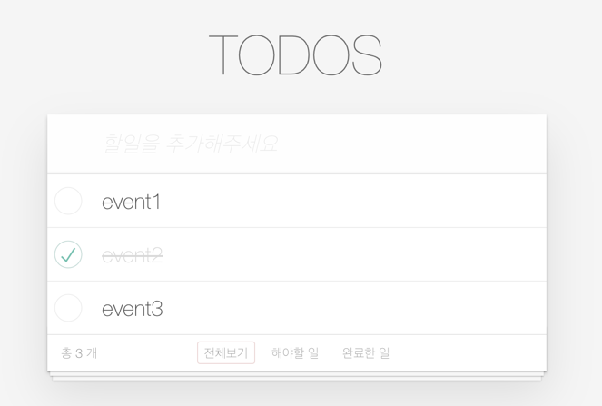
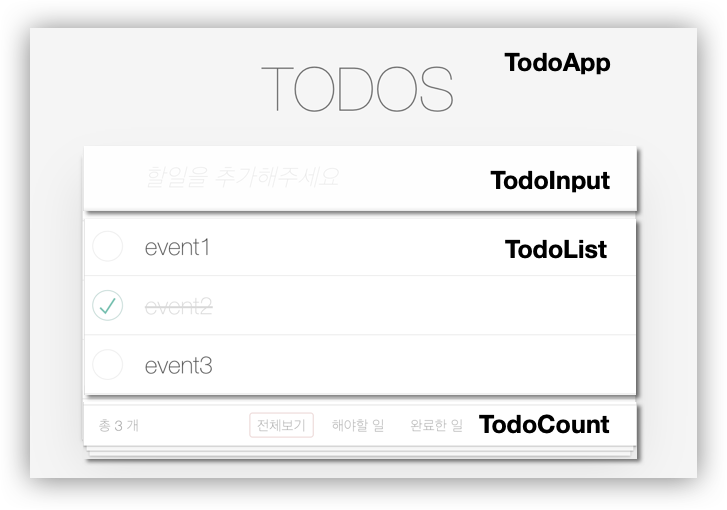
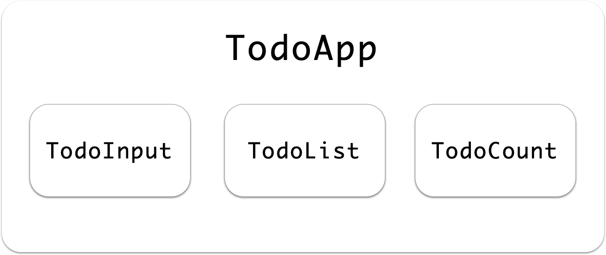
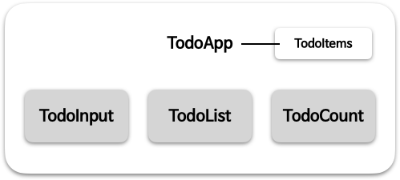

# 🤹🏻 프론트엔드 상태관리

<br>

## 🧑🏼‍🚀 상태 관리를 알아야 하는 이유

❗데이터가 변할 때마다 데이터에 관련된 dom을 일일히 찾아서 조작하고 싶지 않다면  
❗전체 데이터의 형태와 리스트를 한 곳에서 효율적으로 관리하고 싶다면

<br>
<br>

## 🔥 상태란

프론트엔드 프로그래밍을 하면서 상태(state)관리라는 용어를 많이 쓰는데요. 상태란 쉽게 말하면 **_'데이터'_** 라고 생각하면 좋을 것 같습니다. 이 상태 관리는 어플리케이션이 복잡해질수록 점점 어려워집니다. 그렇기 때문에 단순한 구조일때부터 이 상태를 어떻게 관리하면 좋을지에 대한 고민을 충분히 해보는 것은 더 큰 어플리케이션을 만들기 위한 과정에서 중요합니다.

먼저 상태란 무엇일까요? 상태가 있고, 상태가 아닌 것이 있을텐데요. 둘은 어떤 차이가 있을까요? 상태에서 중요한 부분은 바로 값이 변한다는 것입니다. 이 값이 변하는데 예측된 값으로 변해야 의도한대로 동작을 수행할 수 있으니, 예측 범위 안에서 변하게 하는 것이 중요합니다. 그래서 그 예측된 범위를 만들기 위해서, 여러가지 제약조건이나 구조적인 설계를 고민할 수 있습니다.

이 예측 범위를 최소화 하기 위해서는  
상태에 대해  
**_일관되게_** READ하는 로직과,  
**_최소화한_** Write하는 로직을 만들 때 가능해집니다.

범위를 최소화하는거는 모듈 단위, 스코프 단위에 대한 고민으로 확장될 수 있습니다.  
상태에 대한 일관성은 상태를 여러 곳에서 같은 방식으로 READ하는 방식을 고민해볼 수 있습니다.  
상태를 여러 곳에서 직접적으로 수정한다면, 상태를 예측하고 관리하기 어려우니 수정하는 부분을 제한하고, 그 책임을 가지고 있는 대상이 분명하게 역할을 가진다면 최소화한 write가 가능해질 수 있습니다.

프론트엔드의 상태 관리를 Todo List를 통해서 어떻게 할 수 있을지 고민해보겠습니다.



위 TodoList 앱은 TodoItems라는 데이터 값을 가집니다. 그런데 이 데이터를 여러군데에서 관리한다면 한 곳에 변화가 있을 때마다, 모든 변화를 감지하고 반영하려면 중복 코드도 많아지고 불필요한 dom 접근 또한 많아질 수 있습니다. 그렇다면 이 데이터를 어떻게, 어디서 관리하면 좋을까요?

우선 데이터와 관련된 부분들을 체크하기 위해 앞의 문서에서 보았던 것처럼 데이터를 가지고 갱신되야 하는 기준으로 UI를 분리해보겠습니다.



더 세부적으로 분리할 수 도 있지만, 우선은 이 4가지로 분리해볼건데요. 위처럼 구분하고 나면, TodoApp이라는 컴포넌트 안에 TodoInput, TodoList, TodoCount UI들이 포함되어 있습니다.



컴포넌트를 더 세부적으로 분리할 수 도 있지만, 우선은 이 4가지로 컴포넌트를 분리해보도록 하겠습니다, 위처럼 구분하고 나면, TodoApp이라는 컴포넌트 안에 TodoInput, TodoList, TodoCount 컴포넌트들이 포함되어 있습니다. 그리고 `TodoItems`라는 데이터는 `TodoInput`, `TodoList`, `TodoCount` 3개의 컴포넌트와 모두 관련이 있는데요. 그렇다면 `TodoItems`와 연결성을 가진 이 데이터를 어디서 관리하면 좋을까요? 위에서 write는 최소한으로 역할을 부여하면 좋다고 했는데요. 그렇다면 이 상태에서 데이터를 한 곳에서 관리한다면 TodoApp 컴포넌트에서 하고, 다른 컴포넌트들은 그 데이터를 받아와서 보여주기만 한다면 데이터를 일관되게 관리할 수 있을 것 같습니다.



그래서 기본적으로 구현하기에 간단한 구조가 있습니다. 바로 `setState`와 `render`함수의 구현입니다.

<br>
<br>

## 📌 setState & 🖌️ render

input창에 todoItem을 새로 추가한다고 했을 때, 그 추가하는 메서드를 부모 컴포넌트에서 관리하고,  
자식 컴포넌트는 부모 컴포넌트가 데이터를 직접 다루는 메서드를 사용하기만 하는 것입니다.

```js
// 부모 컴포넌트
function TodoApp() {
  this.todoItems = [];

  this.setState = (updatedItems) => {
    this.todoItems = updatedItems;
    todoList.setState(this.todoItems);
  };

  new TodoInput({
    onAdd: (contents) => {
      const newTodoItem = new TodoItem(contents);
      this.todoItems.push(newTodoItem);
      this.setState(this.todoItems);
    },
  });
}

// 입력 받는 컴포넌트
function TodoInput({ onAdd }) {
  const $todoInput = document.querySelector("#new-todo-title");

  $todoInput.addEventListener("keydown", (event) => this.addTodoItem(event));

  this.addTodoItem = (event) => {
    const $newTodoTarget = event.target;
    if (this.isValid(event, $newTodoTarget.value)) {
      onAdd($newTodoTarget.value);
      $newTodoTarget.value = "";
    }
  };
}

// todoList 보여주는 컴포넌트
function TodoList() {
  this.setState = (updatedTodoItems) => {
    this.todoItems = updatedTodoItems;
    this.render(this.todoItems);
  };

  this.render = (items) => {
    const template = items.map(todoItemTemplate);
    this.$todoList.innerHTML = template.join("");
  };
}
```

이렇게 하면, 데이터를 한 곳에서 효율적으로 관리할 수 있고 데이터가 변경되었을 때 렌더링을 새로 해주는 로직도 재사용할 수 있습니다.

<br>
<br>

## 📘 정리

✅ 프론트엔드에서 상태관리는 한 곳에서 하면 효율적으로 할 수 있다.  
✅ 보통은 최상위 컴포넌트나, storage를 따로 두어 관리한다.  
✅ 자식 컴포넌트들은 최상위 상태를 가지고 있는 객체로부터 상태를 받아 render해주는 역할을 한다.
